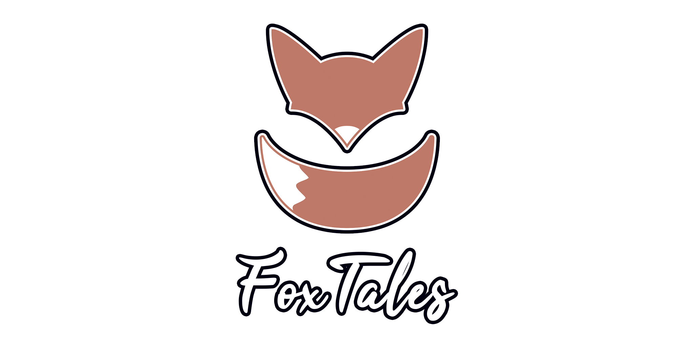
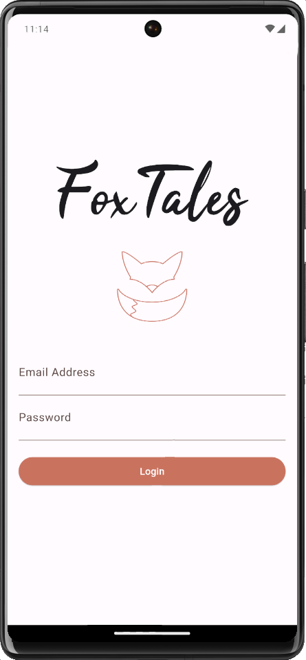
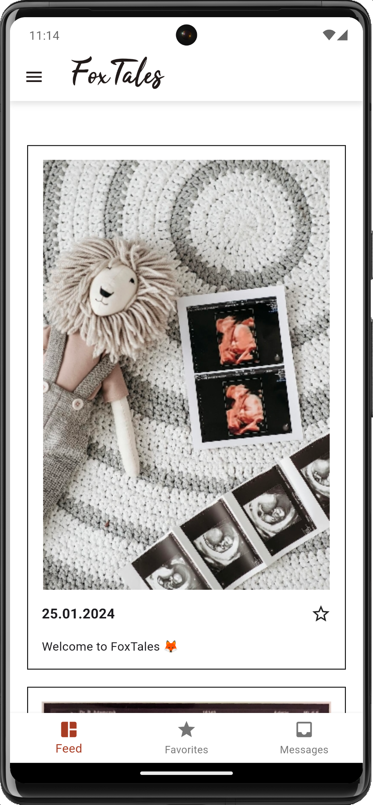
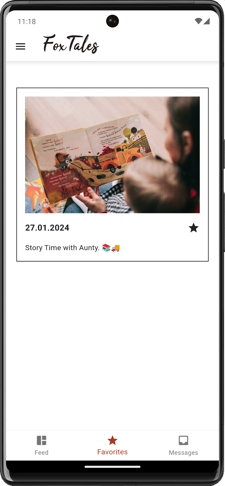
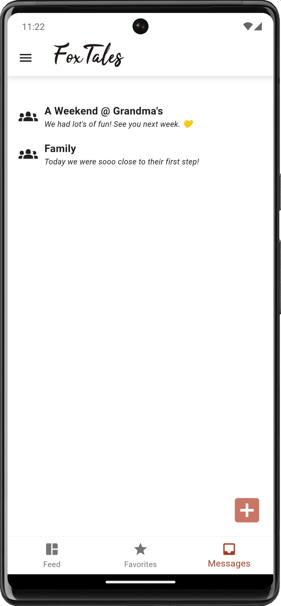
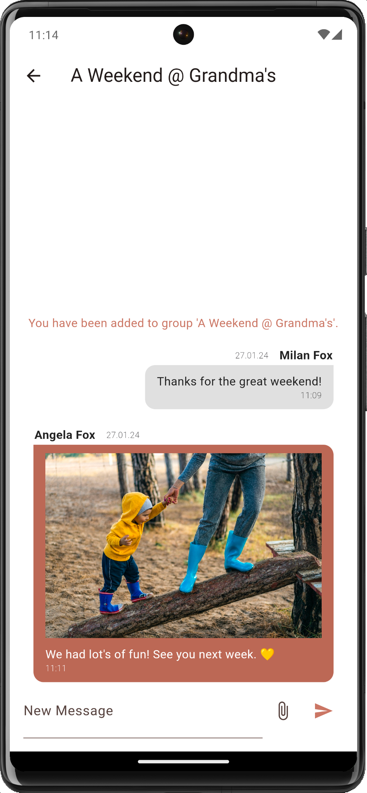
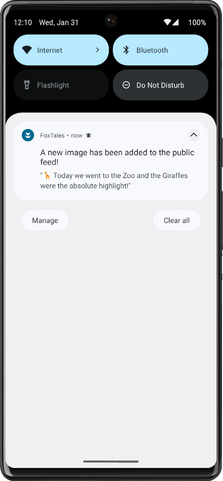
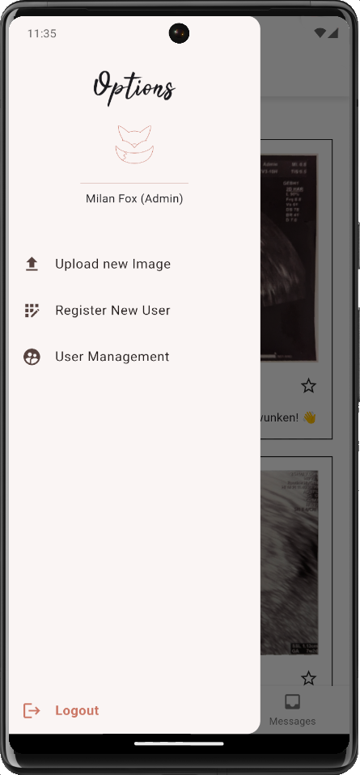

This was a learning project for both Flutter / App Development as well as Google Firebase.
It is no longer being maintained but stying up in case someone finds something of worth in here.
Feel free to explore, modify, and use any code you find here for your own learning and projects.

## Whats the project?

While waiting for our firstborn to arrive I wanted to find out how hard it would be to build a
light social media style / messaging app to safely share videos & images with friends and family.

## Whats the state of the project?

Since I used it as a learning exercise I did finish it to an MVP State, even after deciding to not follow through.
Every function featured in the screenshots does function properly and it is installable on both Android and IOS.

## Why was it discontinued?

Turns out, app development is not fun at all. I don't get how anyone enjoys Flutter..
And needing to pay 100EUR p.a. just to be able to release it on IOS was the nail in the coffin.

## What Features are finished?

### Auth
We are using Firebase Authentication to make sure the content can only be accessed by registered users -
only users with "admin" role can register new users.
 

### Feed
An "Instagram-esque" feed of images that all registered users can see. Only Admins can upload images to that feed.
For now, because of MVP Status, only one image is uploadable at a time. Also no Video support yet.
All Images are optimizes in the backend to not be too demanding on hard drive space.
All Images are also downloaded once viewed and can be viewed offline.
 

### Favorites
A per-user collection of bookmrked images from the feed, so users can build their own collection over time -
since screenshots are disabled in this app for privacy reasons. 
The favorites sync to the cloud and would transfer to a new device.
 

### Messaging
Message individuals or groups of people (like you are used to from your favorite messaging apps)
in order to share pictures and stories that aren't meant for everyone, like memories of events.
Chat Messages are synced to the cloud (like everything is) and will transfer to new devices once logged in.
They are hidden behind the Auth System to gain a minimum of security - they are saved in plain text in the backend though..
so not that secure after all.  
 

### Chats
Since this is mainly a one-directional app (share pictures with people), chats are the only way your users can participate.
Everyone can type in these chats and share picures.
As with the other thing - only one picture at a time and no video support for now.
 

### Notifications
Pictures added to the main Feed will trigger Notifications on all users devices. I didn't bother adding Notifications for the Messaging function.
 

### Admin Panel
Admins have access to options that allows them to add new users, change their roles or upload new pictures to the main feed. 
 

## Is there a Web App?

This is a fully headless project, which means in theory it would be easy to connect a Web App to the service. And there were plans.
But this was outside of the MVP Scope I've set.
